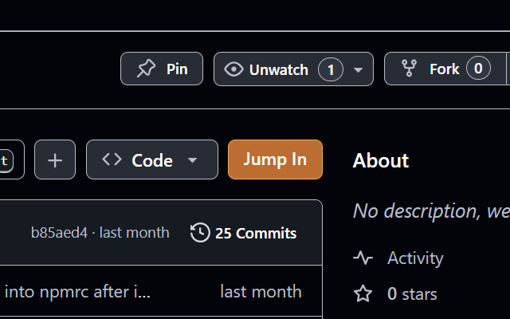

# tunnel-link: Link from any GitHub repo to your VSCode tunnel

This VSCode Web extension opens or clones a GitHub repository in a tunnel when a specific folder is opened and the URL contains `?repo=...` query parameter with repo url.

> ⚠️ Make sure to setup `tunnel-link.baseFolder` setting to point to your base folder where you want the repositories to be cloned/opened. Otherwise this extension will not do anything.

## 🔗 Companion `tunnel-link` extension for Chrome

You should also [install companion extension](https://chromewebstore.google.com/detail/tunnel-link/mmnknemeobjjnfkcphlngcpfbimlkojb) for Chrome that will inject a link on GitHub repository page that you can point to your specific vscode.dev tunnel and base folder.

## 👀 Example setup

Inputs:
- Your VSCode tunnel is `https://vscode.dev/tunnel/dev`
- You set `tunnel-link.baseFolder` to `/home/user/DEV`

When you open this URL in your browser:
`https://vscode.dev/tunnel/dev/home/user/DEV?repo=https://github.com/microsoft/vscode` (either via the chrome extension link or by just entering it manually):
- VSCode Web will open `/home/user/DEV` folder in the `dev` tunnel
- `tunnel-link` extension is activated because of the matching `baseFolder` and `?repo=...` query parameter is present
  - if `https://github.com/microsoft/vscode` was not cloned yet, it will be cloned into `/home/user/DEV/vscode` and opened
  - if it is already cloned, it will just be opened

## 🔨 Extension development setup

Code structure:
- root of this repo is the source for the VSCode Web extension. With `extension.js` entry
- Chrome extension is located in `chrome-ext` folder, with `manifest.json` entry, check links from there to figure out the functionality

### VSCode Web extension

- run `node ./serve-vscode-ext.mjs` to serve the web extension
- execute `Developer: Install Rxtension from Location...` in VSCode and enter `https://localhost:3000`

Publishing:
- make sure to update version in `package.json`
- run `npm run package` to create a `.vsix` file
- go to https://marketplace.visualstudio.com/manage/publishers/<your-publisher-name>
- click `New Extension` and upload the `.vsix` file

### Chrome extension

- go to `chrome://extensions` in chrome
- enable developer mode checkbox
- click `Load unpacked` and select `chrome-ext` folder in this repo
- click reload button on the extension page to sync changes

Publishing:
- make sure to update version in `chrome-ext/manifest.json`
- create zip file of `chrome-ext` folder: `zip -r chrome-ext.zip chrome-ext`
- go to https://chrome.google.com/webstore/developer/dashboard
- click `Add new item`
- upload `chrome-ext.zip` file
- fill in all the details and publish
