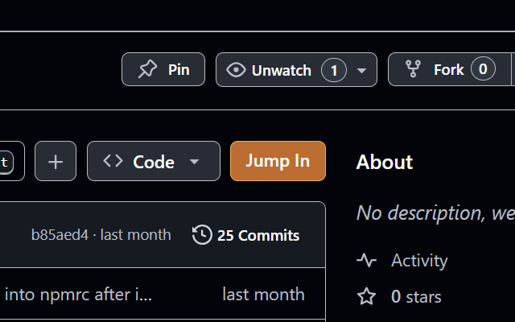

# tunnel-link: Link from any GitHub repo to your VSCode tunnel

This VSCode Web extension opens or clones a GitHub repository in a tunnel when a specific `tunnel-link.baseFolder` (found in extension settings) is opened and the URL contains `?repo=...` query parameter with repo url.

## Companion `tunnel-link` extension for Chrome

You should also [install companion extension]([here](https://chromewebstore.google.com/detail/tunnel-link/mmnknemeobjjnfkcphlngcpfbimlkojb)) for Chrome that will inject a link on GitHub repository page that you can point to your specific vscode.dev tunnel and base folder.

## Example setup

Prereqs:
- Your tunnel name is `https://vscode.dev/tunnel/dev`.
- Your user name in the tunnel is `user`.
- You set `tunnel-link.baseFolder` to `/home/user/DEV`.

When you open this URL in your browser:
`https://vscode.dev/tunnel/dev/home/user/DEV?repo=https://github.com/user/dotfiles` (either via the chrome extension link or by just entering it manually):
- vscode.dev will open `/home/user/DEV` folder in the `dev` tunnel
- `tunnel-link` extension is activated because of the matching `baseFolder` and `?repo=...` query parameter is present
  - if `https://github.com/user/dotfiles` was not cloned yet, it will be cloned into `/home/user/DEV/dotfiles` and opened
  - if it is already cloned, it will just be opened
